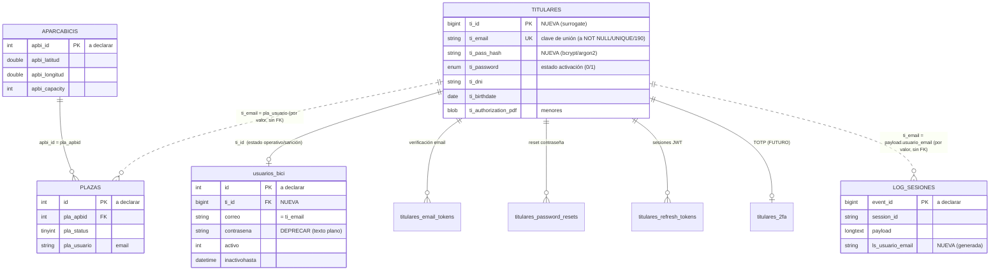

# Modelo de datos MariaDB/InnoDB — Backend AparcaBicis (Fase 1)

> ✅ **MODELO DE DATOS CERRADO — listo para fase 2 (contrato de API).** Todas las decisiones de modelado
> están resueltas. Queda un único punto pendiente que **no afecta al esquema**: la validación formal de
> la política de borrado por el responsable RGPD de R3 RECYMED (§4.5).

- **Fecha:** 2026-06-02
- **Fase:** 1 de 2 — **modelo de datos**. El contrato de API es un encargo posterior; aquí **no** se
  diseñan endpoints.
- **Modo:** SOLO LECTURA sobre la BD real. **No se ha ejecutado ningún `CREATE`/`ALTER`.** Todo el
  DDL de este documento es **propuesta para revisión**.
- **Ámbito:** el modelo de **una** ciudad (hoy `palma`). Por [ADR 0002](adr/0002-multi-ciudad.md) cada
  ciudad es una BD/despliegue independiente; **no** hay columna discriminadora de ciudad ni
  multi-tenant en runtime. Cuentas independientes por ciudad.
- **Fuentes:** [ADR 0001](adr/0001-backend.md), [ADR 0002](adr/0002-multi-ciudad.md),
  [diagnóstico API](diagnostico-api-vs-app.md), el código real de la API y el **esquema real**
  (`SHOW CREATE TABLE` aportado por el cliente el 2026-06-02).

> **Esta versión sustituye al primer borrador.** El esquema real reveló que la identidad **no** se
> construye desde cero: ya existen `TITULARES` (titular/usuario, en uso) y `usuarios_bici` (cuenta
> operativa **con columna `contrasena`**). Decisiones confirmadas por el cliente: **`TITULARES` es la
> tabla canónica del usuario**, el **email es la clave de unión**, `TITULARES` está **en uso**, y
> `usuarios_bici.contrasena` guarda **texto plano**.

---

## 1. Esquema real de partida (leído de la BD)

| Tabla | Motor | Charset/colación | PRIMARY KEY | Rol |
|---|---|---|---|---|
| `APARCABICIS` | InnoDB | utf8mb4_unicode_ci | **NO declarada** | Catálogo de estaciones (lat/lng, dirección, capacidad). |
| `PLAZAS` | InnoDB ✓ | (no mostrado) | **NO declarada** | Plazas/espacios; estado y disponibilidad derivada. |
| `TITULARES` | InnoDB | utf8mb4_unicode_ci | **NO declarada** | **Usuario canónico**: datos personales, menores, (tarjeta). |
| `usuarios_bici` | InnoDB | utf8 / columnas utf8mb4_general_ci | **NO declarada** | Estado operativo + sanción + `correo`/`contrasena`. |
| `LOG_SESIONES` | InnoDB | utf8mb4_general_ci; `payload` longtext utf8mb4_bin | **NO declarada** | Log de eventos de sesión → **fuente del historial**. |
| `DATALOG` | InnoDB | latin1_spanish_ci | **NO declarada** | Auditoría legacy. |
| `log_estado_usuarios` | InnoDB | utf8mb4_unicode_ci | **NO declarada** | Auditoría de sanción. |
| `API_usr` | InnoDB | latin1_spanish_ci | **NO declarada** | **Auth de cliente** (UsrAPI/APIkey). **Intacta.** |

**Tres problemas estructurales transversales** que el modelo debe corregir antes de poder poner FKs:

1. **Ninguna tabla declara PRIMARY KEY.** InnoDB crea internamente un *clustered index* oculto, pero
   **sin PK explícita no se pueden crear FKs** que referencien esas tablas, ni hay garantía de unicidad.
   Hay que añadir PK a las tablas que vayan a participar en integridad referencial.
2. **Charsets mezclados.** Conviven utf8mb4_unicode_ci, utf8mb4_general_ci, utf8 y latin1. El **email**
   —que es la clave de unión de todo el sistema— aparece con longitudes y colaciones distintas en cada
   tabla (`ti_email` varchar(40), `correo` varchar(255) utf8mb4_general_ci, `pla_usuario` varchar(80),
   `Usuario_app` varchar(255) **latin1**, `usuario_correo` varchar(255) utf8mb4). Un `JOIN`/comparación
   entre colaciones distintas **no usa índice** y puede corromper acentos. Hay que **unificar** las
   columnas de email a `varchar(190) utf8mb4_unicode_ci`.
3. **Motor de `PLAZAS`: InnoDB (confirmado por el cliente).** Las FK hacia/desde `PLAZAS` son viables.

### 1.1. Notas de seguridad sobre datos REALES (con tus decisiones aplicadas)

Como `TITULARES` y `usuarios_bici` están **en uso**, esto son datos reales, no hipótesis:

- **`usuarios_bici.contrasena` en texto plano → SE MIGRA** (decisión: estamos a tiempo). Pasada única
  plano→hash (bcrypt/argon2) y purgado de la columna. **La migración NO se hace directa sobre
  producción: se aplica y prueba primero en el gemelo digital y luego se corta a producción de una
  vez** (ver §4.3). **Aprobado.**
- **Columnas de tarjeta `ti_cardnumber`/`ti_cvv`/`ti_monthyeardue`: SE MANTIENEN** (decisión: **no
  conectadas a ninguna UI, sin uso hoy**, reservadas para el futuro). No se eliminan. ⚠️ **Salvedad
  técnica que dejo por escrito:** el día que se vaya a cobrar, el **CVV no debe almacenarse nunca** (lo
  prohíbe PCI-DSS) y el número de tarjeta debe ir **tokenizado vía pasarela**. Mientras las columnas
  sigan vacías no hay exposición; el riesgo aparece si se empiezan a rellenar. **El tratamiento correcto
  del CVV (no almacenarlo) y del PAN (tokenización) se resolverá en el ADR de pagos cuando se diseñe el
  cobro**, fuera del alcance de v1.
- Datos de **menores** (`ti_birthdate`, `ti_guardian_name`, `ti_authorization_pdf`): categoría sensible
  bajo GDPR; el modelo los conserva (ver D10) y su validación de alta/base legal se trata en fase 2.

---

## 2. Modelo de identidad (decisión: TITULARES canónica)

### 2.1. Reparto de responsabilidades

| Tabla | Es | Contiene | Clave |
|---|---|---|---|
| **`TITULARES`** | **Usuario canónico** | Identidad y datos personales del titular (+ credenciales **nuevas**, verificación, 2FA) | `ti_email` (clave de negocio) + PK surrogate nueva `ti_id` |
| `usuarios_bici` | **Estado operativo** | Sanción y actividad (`activo`, `inactivohasta`, `primeraapertura`, `liberacion`, `last_activity`) | `correo` = `ti_email`; enlace nuevo `ti_id` |
| `API_usr` | Auth de **cliente** (no usuario) | UsrAPI/APIkey | — (intacta, no se mezcla) |

**El email es el hilo conductor** ya existente: `TITULARES.ti_email = usuarios_bici.correo =
PLAZAS.pla_usuario = LOG_SESIONES.payload.usuario_email = DATALOG.Usuario_app =
log_estado_usuarios.usuario_correo`. El diseño se ancla en ese email para no reescribir el flujo
operativo (`reserva`/`apertura`/`end_sesion`/`check_inact_user`).

> `ti_password` **no es una contraseña**: es un `enum('0','1')` de estado ("0 recién creado / 1
> activo"). Se conserva como **estado de activación de cuenta**; la credencial real va en columnas
> nuevas (`ti_pass_hash`), no aquí. **(D11 confirmado: `ti_password` es el eje central para decidir si
> un usuario está activo.)**

**Cómo se decide si un usuario puede operar (login/reservar).** Se combinan tres señales, en tablas
distintas, sin duplicar lógica:

1. **Cuenta activa** — `TITULARES.ti_password = '1'` (eje central, D11).
2. **Email verificado** — `TITULARES.ti_email_verificado = 1`. **(D5: verificación OBLIGATORIA;** sin
   ella el usuario no puede reservar. Lo natural es que `ti_password` pase a `'1'` precisamente al
   verificar el email.)
3. **Sin sanción vigente** — `usuarios_bici.activo = 1` y `inactivohasta` ya pasado (lo gestiona el
   crontab de sanción de 14 h; el esquema solo guarda el estado).

La orquestación de estas comprobaciones es de la capa de API (fase 2); el modelo solo provee los datos.

### 2.2. Mapa lógico



---

## 3. ALTER sobre `TITULARES` — convertirla en usuario con auth (propuesta)

> Requiere validar que no hay `ti_email` duplicados/NULL antes de imponer UNIQUE/NOT NULL.

```sql
-- PROPUESTA. Se aplica primero en el gemelo digital (no directo a producción); ver §4.3.
-- Validar antes que no haya ti_email duplicados/NULL.
ALTER TABLE TITULARES
    -- 1) Clave primaria surrogate (hoy no hay PK) para poder referenciarla con FKs
    ADD COLUMN ti_id BIGINT UNSIGNED NOT NULL AUTO_INCREMENT FIRST,
    ADD PRIMARY KEY (ti_id),

    -- 2) Email como clave de unión: ensanchar, no nulo y único
    MODIFY COLUMN ti_email VARCHAR(190)
        CHARACTER SET utf8mb4 COLLATE utf8mb4_unicode_ci NOT NULL,
    ADD UNIQUE KEY uq_titulares_email (ti_email),

    -- 3) Credenciales y seguridad (lo que faltaba)
    ADD COLUMN ti_pass_hash        VARCHAR(255) NULL DEFAULT NULL,   -- bcrypt/argon2
    ADD COLUMN ti_pass_algo        VARCHAR(20)  NOT NULL DEFAULT 'bcrypt',
    ADD COLUMN ti_email_verificado TINYINT(1)   NOT NULL DEFAULT 0,
    ADD COLUMN ti_email_verificado_at DATETIME  NULL DEFAULT NULL,
    ADD COLUMN ti_2fa_habilitado   TINYINT(1)   NOT NULL DEFAULT 0,  -- FUTURO (secreto en titulares_2fa)
    ADD COLUMN ti_intentos_fallidos SMALLINT UNSIGNED NOT NULL DEFAULT 0,
    ADD COLUMN ti_bloqueado_hasta  DATETIME     NULL DEFAULT NULL,   -- rate-limit login
    ADD COLUMN ti_ultimo_login_at  DATETIME     NULL DEFAULT NULL;

-- Las columnas de tarjeta (ti_cardnumber/ti_cvv/ti_monthyeardue) SE MANTIENEN por decisión del
-- cliente (hoy vacías, uso futuro). No se tocan en esta fase. Ver salvedad PCI-DSS en §1.1.
```

Notas:
- `ti_pass_hash` nace `NULL` para permitir la **migración** desde `usuarios_bici.contrasena` (§4.3) y
  el alta de cuentas que aún no han fijado contraseña (coherente con `ti_password='0'` recién creado).
- 2FA: la bandera vive en `TITULARES`; el secreto TOTP en tabla aparte (`titulares_2fa`, §3.bis),
  **diferido** pero previsto.

### 3.bis. Tablas satélite NUEVAS (FK → `TITULARES.ti_id`)

> InnoDB, utf8mb4_unicode_ci. Tokens **siempre hasheados** (nunca en claro). `ti_id` = `BIGINT UNSIGNED`
> para igualar el tipo de la PK de `TITULARES`.

```sql
CREATE TABLE titulares_email_tokens (
    tet_id         BIGINT UNSIGNED NOT NULL AUTO_INCREMENT,
    tet_ti_id      BIGINT UNSIGNED NOT NULL,
    tet_token_hash CHAR(64)        NOT NULL,        -- SHA-256 del token enviado
    tet_expira_at  DATETIME        NOT NULL,
    tet_usado_at   DATETIME        NULL DEFAULT NULL,
    tet_creado_at  DATETIME        NOT NULL DEFAULT CURRENT_TIMESTAMP,
    PRIMARY KEY (tet_id),
    UNIQUE KEY uq_tet_token (tet_token_hash),
    KEY idx_tet_ti (tet_ti_id),
    CONSTRAINT fk_tet_titular FOREIGN KEY (tet_ti_id)
        REFERENCES TITULARES (ti_id) ON DELETE CASCADE ON UPDATE CASCADE
) ENGINE=InnoDB DEFAULT CHARSET=utf8mb4 COLLATE=utf8mb4_unicode_ci;

CREATE TABLE titulares_password_resets (
    tpr_id         BIGINT UNSIGNED NOT NULL AUTO_INCREMENT,
    tpr_ti_id      BIGINT UNSIGNED NOT NULL,
    tpr_token_hash CHAR(64)        NOT NULL,        -- token de un solo uso
    tpr_expira_at  DATETIME        NOT NULL,
    tpr_usado_at   DATETIME        NULL DEFAULT NULL,
    tpr_creado_at  DATETIME        NOT NULL DEFAULT CURRENT_TIMESTAMP,
    PRIMARY KEY (tpr_id),
    UNIQUE KEY uq_tpr_token (tpr_token_hash),
    KEY idx_tpr_ti (tpr_ti_id),
    CONSTRAINT fk_tpr_titular FOREIGN KEY (tpr_ti_id)
        REFERENCES TITULARES (ti_id) ON DELETE CASCADE ON UPDATE CASCADE
) ENGINE=InnoDB DEFAULT CHARSET=utf8mb4 COLLATE=utf8mb4_unicode_ci;

CREATE TABLE titulares_refresh_tokens (
    trt_id          BIGINT UNSIGNED NOT NULL AUTO_INCREMENT,
    trt_ti_id       BIGINT UNSIGNED NOT NULL,
    trt_token_hash  CHAR(64)        NOT NULL,       -- SHA-256 del refresh token
    trt_emitido_at  DATETIME        NOT NULL DEFAULT CURRENT_TIMESTAMP,
    trt_expira_at   DATETIME        NOT NULL,
    trt_revocado_at DATETIME        NULL DEFAULT NULL,
    trt_dispositivo VARCHAR(190)    NULL DEFAULT NULL,
    PRIMARY KEY (trt_id),
    UNIQUE KEY uq_trt_token (trt_token_hash),
    KEY idx_trt_ti (trt_ti_id),
    KEY idx_trt_expira (trt_expira_at),
    CONSTRAINT fk_trt_titular FOREIGN KEY (trt_ti_id)
        REFERENCES TITULARES (ti_id) ON DELETE CASCADE ON UPDATE CASCADE
) ENGINE=InnoDB DEFAULT CHARSET=utf8mb4 COLLATE=utf8mb4_unicode_ci;

-- FUTURO (2FA diferido, previsto para no migrar en disruptivo):
CREATE TABLE titulares_2fa (
    t2f_ti_id         BIGINT UNSIGNED NOT NULL,
    t2f_totp_secret   VARBINARY(255)  NOT NULL,     -- secreto TOTP CIFRADO en reposo
    t2f_confirmado_at DATETIME        NULL DEFAULT NULL,
    t2f_creado_at     DATETIME        NOT NULL DEFAULT CURRENT_TIMESTAMP,
    PRIMARY KEY (t2f_ti_id),
    CONSTRAINT fk_t2f_titular FOREIGN KEY (t2f_ti_id)
        REFERENCES TITULARES (ti_id) ON DELETE CASCADE ON UPDATE CASCADE
) ENGINE=InnoDB DEFAULT CHARSET=utf8mb4 COLLATE=utf8mb4_unicode_ci;

-- DIFERIDO (push se implementa el último; ver D6). Tokens de dispositivo para FCM/APNs.
-- Un titular puede tener varios dispositivos; los tokens rotan, por eso van en tabla propia
-- (no como columna del refresh token). El payload de las notificaciones NUNCA lleva PII.
CREATE TABLE titulares_push_tokens (
    tpt_id        BIGINT UNSIGNED NOT NULL AUTO_INCREMENT,
    tpt_ti_id     BIGINT UNSIGNED NOT NULL,
    tpt_plataforma ENUM('android','ios') NOT NULL,
    tpt_token     VARCHAR(255)    NOT NULL,            -- registration token de FCM (o APNs si va directo)
    tpt_activo    TINYINT(1)      NOT NULL DEFAULT 1,
    tpt_creado_at DATETIME        NOT NULL DEFAULT CURRENT_TIMESTAMP,
    tpt_actualizado_at DATETIME   NOT NULL DEFAULT CURRENT_TIMESTAMP ON UPDATE CURRENT_TIMESTAMP,
    PRIMARY KEY (tpt_id),
    UNIQUE KEY uq_tpt_token (tpt_token),
    KEY idx_tpt_ti (tpt_ti_id),
    CONSTRAINT fk_tpt_titular FOREIGN KEY (tpt_ti_id)
        REFERENCES TITULARES (ti_id) ON DELETE CASCADE ON UPDATE CASCADE
) ENGINE=InnoDB DEFAULT CHARSET=utf8mb4 COLLATE=utf8mb4_unicode_ci;
```

---

## 4. ALTER sobre el resto de tablas existentes (propuesta — NO ejecutados)

### 4.1. `APARCABICIS` — clave primaria para el catálogo

```sql
-- PROPUESTA. Verificar antes que no haya apbi_id duplicados.
ALTER TABLE APARCABICIS
    ADD PRIMARY KEY (apbi_id);
```
Sin esto no se puede crear la FK `PLAZAS.pla_apbid → APARCABICIS.apbi_id`. `apbi_id` es `int(3)`;
`PLAZAS.pla_apbid` también es `int(3)` → **tipos compatibles** para la FK.

### 4.2. `PLAZAS` — PK, FK al catálogo e índice de disponibilidad

```sql
-- PROPUESTA. PLAZAS confirmado InnoDB → la FK es viable.
ALTER TABLE PLAZAS
    ADD PRIMARY KEY (id),
    ADD KEY idx_plazas_disp (pla_apbid, pla_status, pla_elect),
    ADD CONSTRAINT fk_plazas_apbi FOREIGN KEY (pla_apbid)
        REFERENCES APARCABICIS (apbi_id) ON DELETE RESTRICT ON UPDATE CASCADE;
```
- `pla_usuario` (email) **no se enlaza con FK**: es operativo y de valor (varchar 80). Se mantiene como
  email; opcionalmente unificar a `varchar(190) utf8mb4_unicode_ci` para casar colación con `ti_email`.
- **Disponibilidad derivada** (ADR): `COUNT` por `pla_status` agrupado por `pla_apbid`. El índice
  `idx_plazas_disp` lo soporta. **No se crea tabla de disponibilidad.**

> **Contadores denormalizados en `APARCABICIS`.** `apbi_cargadisp`/`apbi_sincargadisp` (y sus totales
> `apbi_capcarga`/`apbi_sincapcarga`) guardan "disponibles" en la propia estación. **D8 resuelto: la
> fuente de verdad de disponibilidad es la DERIVADA de `PLAZAS`** (`COUNT` por `pla_status`). Esos
> contadores de `APARCABICIS` quedan como **caché/denormalización no autoritativa**; si se siguen
> usando, deben **recalcularse** desde `PLAZAS` (trigger o job) para no divergir. El modelo no depende
> de ellos.

### 4.3. `usuarios_bici` — estado operativo + migración de la contraseña

```sql
-- PROPUESTA
ALTER TABLE usuarios_bici
    ADD PRIMARY KEY (id),
    ADD COLUMN ti_id BIGINT UNSIGNED NULL DEFAULT NULL AFTER id,
    MODIFY COLUMN correo VARCHAR(190)
        CHARACTER SET utf8mb4 COLLATE utf8mb4_unicode_ci NOT NULL,
    ADD KEY idx_ubici_ti (ti_id),
    ADD CONSTRAINT fk_ubici_titular FOREIGN KEY (ti_id)
        REFERENCES TITULARES (ti_id) ON DELETE SET NULL ON UPDATE CASCADE;
```

**Migración de la contraseña (texto plano → hash). NO se ejecuta directa sobre producción.**

Tanto esta migración como **todos los `ALTER` de este documento** se aplican siguiendo una estrategia de
**gemelo digital**, no como operación directa contra producción:

1. **Gemelo digital primero.** Se aplican y prueban todos los `ALTER`, los scripts de migración (incluido
   plano→hash) y los **endpoints de la app** sobre el **gemelo digital** — una réplica con **datos reales
   de producción**. Allí se valida que el esquema, la migración de contraseñas y el flujo completo de la
   app funcionan de extremo a extremo.
2. **Pasos de la migración de contraseña (sobre el gemelo):**
   a. Rellenar `TITULARES.ti_id` ↔ `usuarios_bici` por email (`correo = ti_email`).
   b. Por cada cuenta con `usuarios_bici.contrasena` no vacía y `TITULARES.ti_pass_hash` NULL:
      `ti_pass_hash = bcrypt(contrasena)` (se puede hashear directamente al estar en claro).
   c. **Purgar** `usuarios_bici.contrasena` (vaciar y luego `DROP COLUMN`).
3. **Corte a producción "de una vez".** Solo cuando **todo** está verificado en el gemelo se hace el
   *cutover* a producción en una única ventana, con:
   - **Backup completo** de la BD de producción inmediatamente antes.
   - **Plan de rollback** preparado y probado, listo para revertir al instante si algo falla.

```sql
-- Tras verificar la migración en el gemelo y completar el cutover:
-- ALTER TABLE usuarios_bici DROP COLUMN contrasena;
```
- `ON DELETE SET NULL`: al borrar el titular se rompe el enlace; el registro operativo de `usuarios_bici`
  y su `correo` también se eliminan en el borrado de cuenta (ver §4.5, borrado físico completo).

### 4.4. `LOG_SESIONES` — historial consultable por usuario (decisión A4)

`payload` es **`longtext` (utf8mb4_bin)**, no `JSON` nativo: la extracción funciona igual porque el
contenido es JSON válido. Columna **generada `STORED`** + índices, **sin tocar a los escritores**:

```sql
-- PROPUESTA
ALTER TABLE LOG_SESIONES
    ADD PRIMARY KEY (event_id),
    ADD COLUMN ls_usuario_email VARCHAR(190)
        CHARACTER SET utf8mb4 COLLATE utf8mb4_unicode_ci
        AS (JSON_UNQUOTE(JSON_EXTRACT(payload, '$.usuario_email'))) STORED,
    ADD KEY idx_ls_usuario_email (ls_usuario_email),
    ADD KEY idx_ls_session (session_id),
    ADD KEY idx_ls_evento (event_type);
```
- Colación fijada a `utf8mb4_unicode_ci` para que cruce por índice con `TITULARES.ti_email`.
- **Sin FK a `TITULARES`** a propósito: no se acopla cada escritura del log al ciclo de vida de la
  identidad. Enlace **por valor** (`ls_usuario_email = ti_email`). El borrado de cuenta elimina estas
  filas mediante una **pasada explícita de borrado por email**, no por cascada de FK (ver §4.5).
- El historial se reconstruye agrupando por `session_id` (`reserved → opened* → closed/cancelled`).
  Conviene encapsularlo en una **VISTA** `v_historial_titular` (la consulta concreta llegará en fase 2).
- **Nota de operación:** añadir una columna `STORED` reescribe filas; si la tabla es grande, hacerlo en
  ventana de mantenimiento.
- Limitación ya señalada: `dock_id`/`plaza_id` son `varchar(2)` (2 dígitos), no identifican el locker
  real si su id >99. No afecta al historial por email.

### 4.5. Borrado de cuenta físico COMPLETO (D4)

**D4 resuelto:** el borrado de cuenta es **físico y completo**. Al borrar la identidad se **eliminan
también físicamente** todas las entradas del usuario en los logs. **No se conserva ni se anonimiza el
email en ningún sitio.** Esto cumple el **derecho de supresión del RGPD** sin necesidad de invocar una
base legal de retención del email.

| Dato | Acción | Motivo |
|---|---|---|
| `titulares_email_tokens`, `titulares_password_resets`, `titulares_refresh_tokens`, `titulares_2fa`, `titulares_push_tokens` | **Borrado físico** (`ON DELETE CASCADE`) | Sin valor sin la cuenta. |
| `TITULARES` (PII: DNI, dirección, tarjeta, PDF de menor, credenciales) | **Borrado físico** de la fila | Es la cuenta; D4 = borrado físico. |
| `usuarios_bici` (estado operativo/sanción, `correo`) | **Borrado físico** de la(s) fila(s) del usuario | Supresión total; no se conserva el `correo`. |
| `PLAZAS.pla_usuario` | Liberar si hay sesión activa, luego limpiar | No dejar una plaza ocupada por una cuenta borrada. |
| `LOG_SESIONES` (filas con `ls_usuario_email = email`), `DATALOG` (`Usuario_app = email`), `log_estado_usuarios` (`usuario_correo = email`) | **Borrado físico** de las filas del usuario | Supresión total del RGPD; no queda email en auditoría. |

Como los logs guardan el email **como cadena** (no como FK), su borrado se hace con una **pasada
explícita de `DELETE ... WHERE <columna_email> = :email`** sobre `LOG_SESIONES`, `DATALOG` y
`log_estado_usuarios` (y el borrado de `TITULARES`/satélites por cascada de FK). El resultado es que,
tras el borrado, **no queda ningún rastro del dato personal** del usuario en el sistema.

- **Implicación de producto:** se pierde el historial del usuario borrado (es lo correcto para una
  supresión RGPD completa). Si la persona se reregistra con el mismo email, **empieza de cero**: no se
  reenlaza a ningún historial previo porque ya no existe.
- **Operación:** el borrado es una **transacción** que agrupa el `DELETE` de identidad/satélites y las
  pasadas de borrado en los logs, para que sea atómico (todo o nada).

> 📌 **Pendiente (no bloquea el esquema): validación formal de la política de borrado por el responsable
> RGPD de R3 RECYMED.** El modelo ya soporta la supresión completa; falta el visto bueno formal de
> protección de datos antes de operar el borrado en producción.

---

## 5. Notas sobre claves foráneas InnoDB e índices

1. **Igualdad de tipos exacta.** FK exige tipo/signo/colación idénticos. Por eso `ti_id` es
   `BIGINT UNSIGNED` en `TITULARES` y en todas las hijas; `pla_apbid`/`apbi_id` son ambos `int(3)`.
2. **InnoDB en ambas partes.** Confirmado en **todas** (incluida `PLAZAS`). Las FK son viables.
3. **PK explícitas primero.** Hay que añadir PK a `TITULARES`, `APARCABICIS`, `PLAZAS`, `usuarios_bici`
   y `LOG_SESIONES` antes de poder referenciarlas o garantizar unicidad.
4. **`ON DELETE` deliberado:** `CASCADE` para satélites de auth; `RESTRICT` para plaza→catálogo (no
   borrar una estación con plazas); **sin FK** (enlace por valor) en los logs — su borrado en la
   supresión de cuenta se hace por **pasada explícita de `DELETE` por email** dentro de la transacción
   de borrado (§4.5).
5. **Unificar colación del email** a `utf8mb4_unicode_ci` en `ti_email`, `correo`, `pla_usuario` y la
   columna generada de `LOG_SESIONES`, para que los cruces por email usen índice.
6. **Tokens hasheados e indexados por hash** (`UNIQUE` sobre `*_token_hash`); índices de caducidad para
   purgas.

---

## 6. Resumen de cambios

| Objeto | Acción |
|---|---|
| `TITULARES` | ALTER: + PK `ti_id`, email NOT NULL/UNIQUE/190, + columnas de credenciales/verificación/2FA/lockout. Tarjeta/CVV **se mantienen** (D9). |
| `titulares_email_tokens` / `_password_resets` / `_refresh_tokens` / `_2fa` | CREATE (satélites de auth, FK→`ti_id`) |
| `titulares_push_tokens` | CREATE **diferido** (push el último, D6); FK→`ti_id` |
| `usuarios_bici` | ALTER: + PK, + `ti_id` FK (SET NULL), email a utf8mb4_unicode_ci; **migrar y purgar `contrasena`** (vía gemelo, §4.3). En borrado de cuenta: **borrado físico** (D4). |
| `APARCABICIS` | ALTER: + PRIMARY KEY (`apbi_id`) |
| `PLAZAS` | ALTER: + PK, + FK al catálogo, + índice disponibilidad (InnoDB confirmado) |
| `LOG_SESIONES` | ALTER: + PK, + columna generada `ls_usuario_email` + índices. En borrado de cuenta: **filas del usuario borradas** (D4). |
| `DATALOG`, `log_estado_usuarios` | Sin cambio estructural; en borrado de cuenta sus filas del usuario se **borran físicamente** (D4) |
| `API_usr` | **Intacta** (auth de cliente) |
| Favoritos / tarifas/cobro | **No se modelan** (A1 locales / A2 gratis) |

---

## 7. Estado de decisiones

### 7.1. Resueltas (aplicadas en este documento)

- **Motor de `PLAZAS`:** InnoDB ✓ → FK `PLAZAS → APARCABICIS` viable.
- **Migración de `usuarios_bici.contrasena`:** aprobada (plano → hash, luego purgar). **Se aplica vía
  gemelo digital**, no directa a producción: pruebas en réplica con datos reales (esquema + scripts +
  endpoints), y luego *cutover* único a producción con **backup completo** y **rollback** preparado
  justo antes (§4.3). Aplica a **todos los `ALTER`** de este documento.
- **D4 — Borrado físico COMPLETO.** Al borrar la cuenta se borran también físicamente las filas del
  usuario en `LOG_SESIONES`, `DATALOG` y `log_estado_usuarios` (sin conservar ni anonimizar el email):
  supresión RGPD total, sin base legal de retención (§4.5).
- **D5 — Verificación de email OBLIGATORIA** antes de reservar (`ti_email_verificado`).
- **D8 — Disponibilidad derivada de `PLAZAS`**; `apbi_*disp` = caché no autoritativa.
- **D9 — Tarjeta/CVV: se mantienen** (vacías hoy, uso futuro). Salvedad PCI-DSS documentada en §1.1.
- **D10 — Menores en alcance:** el esquema conserva tutor + PDF de autorización; las validaciones de
  alta y la base legal se concretan en la capa de API (fase 2).
- **D11 — `ti_password` = eje de cuenta activa**; credencial en `ti_pass_hash`.

- **D6 — Push: se hará, en último lugar, vía FCM como transporte** (FCM HTTP v1 desde el backend, que
  reenvía a APNs en iOS), con payloads **sin PII** y tokens en BD UE (+ DPA con Google). Es transporte,
  no Firebase-plataforma → compatible con el ADR 0001. Huella en el modelo: tabla **diferida**
  `titulares_push_tokens` (§3.bis), no una columna en el refresh token.

### 7.2. Pendiente (no bloquea el esquema; fase 2 puede arrancar)

- **Validación formal de la política de borrado por el responsable RGPD de R3 RECYMED** (§4.5). El
  esquema ya soporta la supresión completa; falta el visto bueno de protección de datos antes de operar
  el borrado en producción.

---

*No se ha ejecutado ningún `CREATE`/`ALTER`/`DROP`/`UPDATE` sobre la base real. Todo el DDL aquí es
propuesta para tu revisión; cualquier cambio (incluida la migración de contraseñas) se aplicará solo
tras tu aprobación.*
